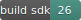

<a href="Documentation/" target="_blank"><a>
<a href="LICENSE" target="_blank"><a>
 

## About 

This pockemon game is based on the concept of hiding pockemon balls at different location in google maps. User needs to visit those locations to collect the balls.Once who collected maximum ball at the end will win the game. 

## Features
- Different pockemons ball can be hide at different places.
- User need to go to those location to callect the balls.
- Score record.

# Screenshots #

### Basic layout

||||
|:---:|:---:|:---:|
|**Pockemon on different location**|**Pockemon catched**|**Game points is increasing**|

## Tools Used
* [Android Studio](https://developer.android.com/studio) : Used as the Android developement environment.
* [Goole Maps](https://cloud.google.com/maps-platform/maps) : Used for locating and picking pockemon balls.

<!-- * [Firebase Realtime Database](https://firebase.google.com/products/realtime-database) : Used as the backend database.
* [Firebase Storage](https://firebase.google.com/products/storage) : Use to store product Image
* [Firebase Authentication](https://firebase.google.com/products/auth) : Used to manage User information -->

## Future Possibilities and Extension of this project
- Can be extended for multiple player.
- Private room feature can be added once connected with cloud.
- Event can be organised at various levels.

## Contributing
You are welcome to contribute :

1. [Fork it](https://github.com/saurabhpandey9/Pockemon-Game/fork) :`https://github.com/saurabhpandey9/Pockemon-Game/fork`
2. Create new branch : `git checkout -b new_feature`
3. Commit your changes : `git commit -am 'Added new_feature'`
4. Push to the branch : `git push origin new_feature`
5. Submit a pull request!

## Author 
**Thanks for going through this Repository! Have a nice day.** 
 **Saurabh Pandey** 
#### **Contact** :`saurabh17100@gmail.com`

## License
This Project is licensed under the MIT License, see the [LICENSE](LICENSE) file for details.
 
 

